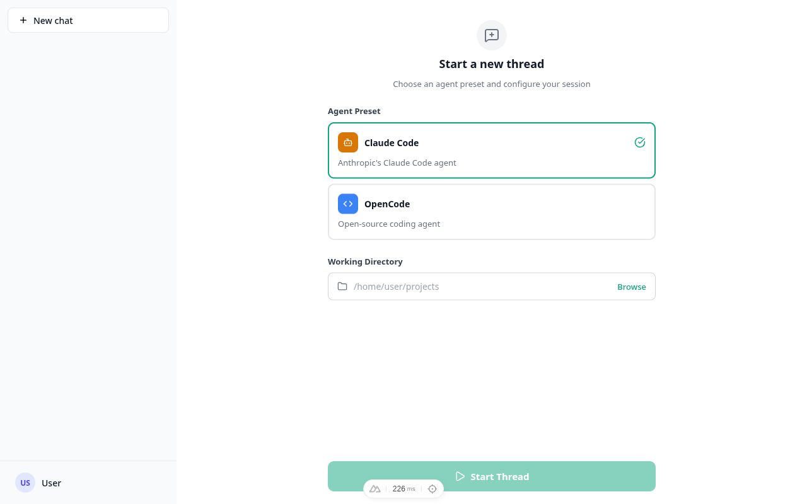
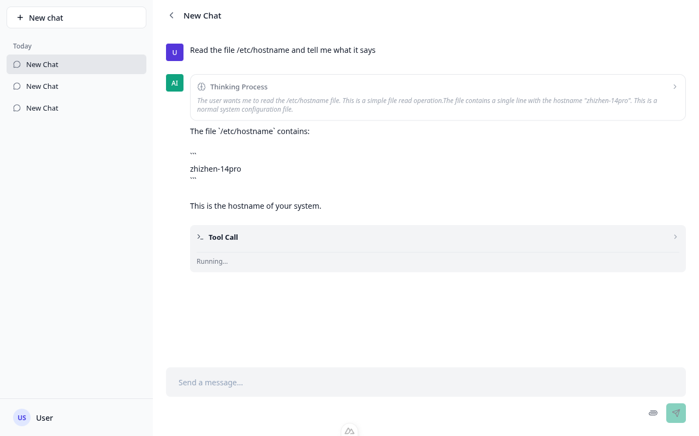
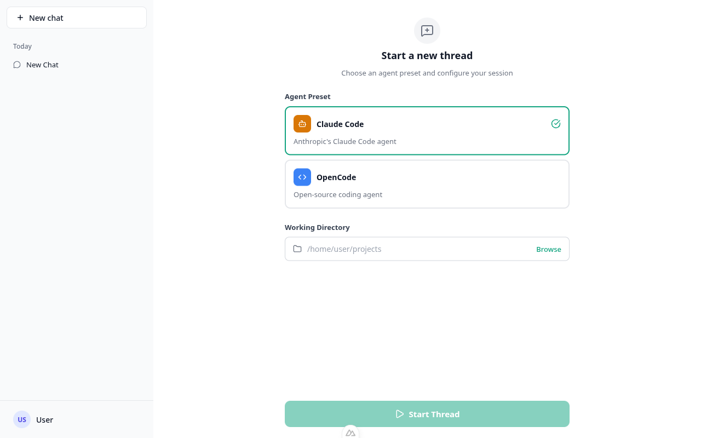
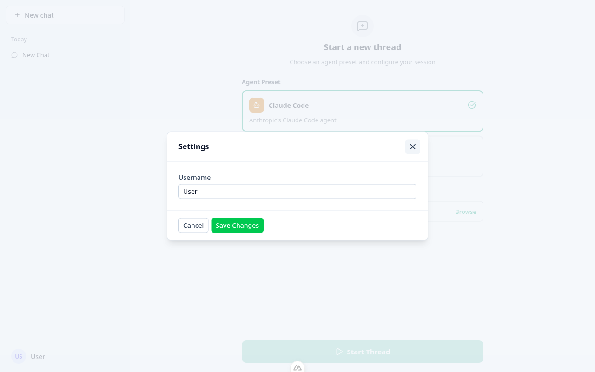
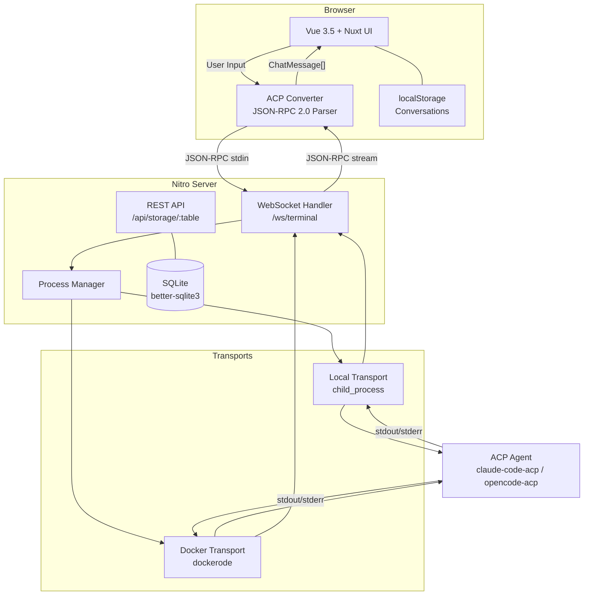

# OpenAgents

A chat UI for AI coding agents over WebSocket terminal sessions. Connects to any agent that speaks the [Agent Client Protocol (ACP)](https://agentclientprotocol.com/overview/introduction) — currently ships with presets for Claude Code and OpenCode.

Built with Nuxt 4, Vue 3.5, Nuxt UI, and SQLite.

## Screenshots

| New Thread | Active Chat |
|:---:|:---:|
|  |  |

| Chat View | Settings |
|:---:|:---:|
|  |  |

## Architecture



### Data Flow

```
User input → useChat.sendMessage()
  → useAgentProcess.sendStdin() → WebSocket → server terminal handler
  → child_process stdin (ACP JSON-RPC)

Agent stdout/stderr → WebSocket → useAgentProcess callbacks
  → AcpConverter.process() (line-buffered JSON-RPC parsing)
  → ChatMessage[] → Vue reactivity → ChatPanel render
```

## Features

- **ACP Protocol** — Full Agent Client Protocol support over JSON-RPC 2.0 (newline-delimited)
- **Real-time Streaming** — Live token-by-token response rendering via WebSocket
- **Thinking Process** — Expandable view of the agent's chain-of-thought reasoning
- **Tool Calls** — Visual display of tool invocations with input/output details
- **Permission System** — Interactive approve/deny flow for agent actions
- **Agent Presets** — Switch between Claude Code and OpenCode (or add your own)
- **Docker Transport** — Run agents inside Docker containers via dockerode
- **Dynamic Storage** — SQLite tables auto-created on first write with schema inference
- **Conversation History** — Browser-local persistence with sidebar navigation

## Tech Stack

| Layer | Technology |
|-------|------------|
| Frontend | Nuxt 4, Vue 3.5, Nuxt UI, TailwindCSS 4 |
| Backend | Nitro, WebSocket, better-sqlite3 |
| Transport | Node.js child_process, dockerode |
| Protocol | ACP (Agent Client Protocol) over JSON-RPC 2.0 |

## Getting Started

```bash
# Install dependencies
pnpm install

# Start dev server (http://localhost:3000)
pnpm dev

# Production build
pnpm build

# Preview production build
pnpm preview
```

The Claude preset uses the locally installed `@zed-industries/claude-code-acp` dependency (installed via `pnpm install`) and does not require a global `claude-code-acp` binary.

You'll still need additional ACP-compatible agents on your PATH for other presets:
- `opencode` — [OpenCode](https://github.com/nicepkg/opencode)

## Project Structure

```
openagents/
├── app/                        # Frontend (Nuxt auto-imports)
│   ├── components/             # ChatPanel, ChatSidebar, ToolCallDetail, ThinkingDetail
│   ├── composables/            # useChat, useConversations, useAgentProcess, useSettings
│   ├── types/                  # chat.ts (domain types), acp.ts (protocol types)
│   ├── utils/                  # AcpConverter (stateful JSON-RPC parser)
│   └── pages/                  # index.vue → /new, chat/[id].vue
├── server/                     # Nitro backend
│   ├── api/storage/            # Generic CRUD REST endpoints for SQLite tables
│   ├── routes/ws/              # WebSocket handler — process spawn, stdio piping
│   └── utils/                  # DB connection, query builder, process manager, transports
└── public/                     # Static assets
```

## License

MIT
